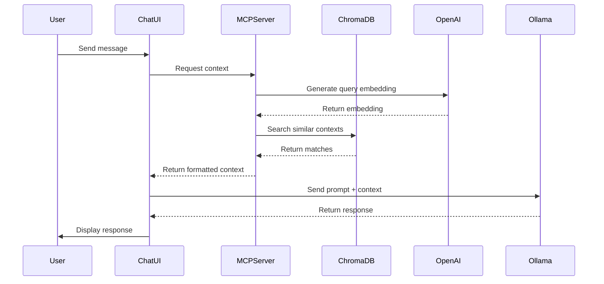

# RAG-Enhanced Chat Application Plan

## Overview
This project implements a Retrieval-Augmented Generation (RAG) chat application that combines local document knowledge with LLM capabilities. The system uses a local Ollama instance with the phi4 model, OpenAI's text-embedding-ada-002 model for embeddings, and ChromaDB for vector storage.

## Architecture Components

### 1. MCP Server (Context Provider)
- **Purpose**: Manages document storage, retrieval, and context generation
- **Components**:
  - Document Indexer
    - Scans local directory for .md files
    - Chunks documents into segments
    - Generates embeddings using OpenAI's text-embedding-ada-002
  - ChromaDB Integration
    - Persistent vector storage
    - Collection management for document embeddings
    - Efficient similarity search capabilities
  - Context Generator
    - Performs semantic search using ChromaDB
    - Ranks and selects most relevant context
    - Formats context for LLM consumption

### 2. Chat Application (Client)
- **Purpose**: Provides user interface and orchestrates interactions
- **Components**:
  - Web Interface
    - Chat UI for user interactions
    - Message history display
  - Context Integration
    - Communicates with MCP server
    - Combines context with user queries
  - Ollama Integration
    - Manages LLM interactions with phi4 model
    - Handles response streaming

## Implementation Plan

### Phase 1: MCP Server Development
1. **Setup**
   - Initialize Python-based MCP server
   - Set up ChromaDB
   - Configure OpenAI API client
   - Implement file system monitoring

2. **Document Processing**
   ```python
   # Example document processing pipeline
   class DocumentProcessor:
       def __init__(self):
           self.embedding_model = "text-embedding-ada-002"
           self.chroma_client = chromadb.PersistentClient()
           self.collection = self.chroma_client.create_collection("documents")
   
       async def process_document(self, file_path: str):
           # Read and chunk document
           chunks = self.chunk_document(file_path)
           
           # Generate embeddings
           embeddings = await self.generate_embeddings(chunks)
           
           # Store in ChromaDB
           self.collection.add(
               embeddings=embeddings,
               documents=chunks,
               ids=[f"{file_path}_{i}" for i in range(len(chunks))]
           )
   ```

3. **Context Generation**
   ```python
   # Example context retrieval
   class ContextGenerator:
       async def get_context(self, query: str, k: int = 3):
           # Generate query embedding
           query_embedding = await self.generate_embedding(query)
           
           # Search ChromaDB
           results = self.collection.query(
               query_embeddings=[query_embedding],
               n_results=k
           )
           
           return self.format_context(results)
   ```

### Phase 2: Chat Application Enhancement
1. **MCP Integration**
   ```typescript
   // Example context fetching
   async function getContext(query: string): Promise<string> {
       const response = await fetch('/api/context/generate', {
           method: 'POST',
           body: JSON.stringify({ query, k: 3 })
       });
       return response.json();
   }
   ```

2. **UI Updates**
   - Add context visualization
   - Implement loading states
   - Enhance error handling

### Phase 3: Integration & Testing
1. **System Integration**
   - Connect all components
   - Implement error handling
   - Add logging and monitoring

2. **Testing**
   - Unit tests for each component
   - Integration tests
   - Performance testing

## Technical Specifications

### MCP Server API
```typescript
interface MCPServer {
  // Resource endpoints
  GET /documents/list              // List available documents
  GET /documents/content/:id       // Get document content
  
  // Tool endpoints
  POST /context/generate          // Generate context for query
  POST /documents/update          // Update document index
}
```

### Vector Store Schema (ChromaDB)
```python
Collection {
    name: "documents",
    metadata: {
        "source": str,          # Original file path
        "chunk_index": int,     # Position in document
        "last_updated": str     # Timestamp
    },
    embedding_function: "text-embedding-ada-002",
    embedding_dimension: 1536   # OpenAI embedding dimension
}
```

### Context Generation Flow


## Resources
- OpenAI API key for embeddings
- ChromaDB for vector storage
- Local Ollama instance with phi4 model
- Markdown document collection
- Web browser for interface

## Next Steps
1. Set up Python MCP server with ChromaDB
2. Implement OpenAI embedding generation
3. Create document processing pipeline
4. Enhance chat application with context integration
5. Test with sample markdown documents
6. Deploy and validate full system

## Success Criteria
- Successful embedding generation and storage
- Efficient context retrieval from ChromaDB
- Improved response quality with context
- Seamless user experience
- Real-time context updates
- Persistent vector storage across restarts